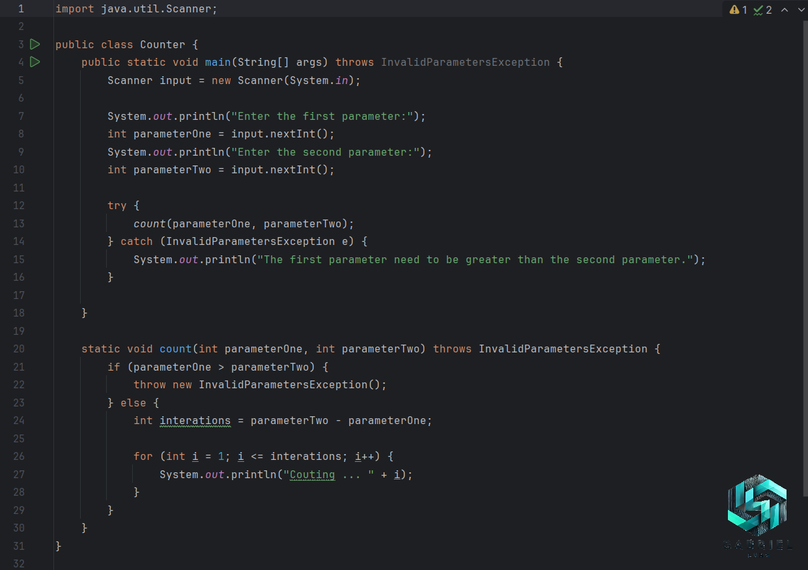

# Controle de Fluxo

O projeto controle de fluxo consiste em um pequeno contador que funciona da seguinte forma. O sistema pede ao usuário que informe dois números, exemplo, 02 e 07. O sistema então inicia um contador partindo de 02 até o limite indicado pelo usuário, que no exemplo é 07.

## 🔨 Funcionalidades do projeto

No projeto `controle de fluxo` o usuário consegue estar definindo em qual número o contador irá começar e terminar por meio de `parâmetros`. O contador também conta com uma `mensagem sutil de erro`, caso o usuário insira o segundo número maior que o primeiro.

## 📝 Técnicas e tecnologias utilizadas

- `Try` e `Catch`
- Tratamento de erro por meio de `Exception`
- Estruturas condicionais `if` e `else`
- Laço de repetição `for`

 

 

> Fique a vontade para deixar o seu feedback sobre boas práticas, ou como você teria feito! _A vida é um eterno aprendizado!_